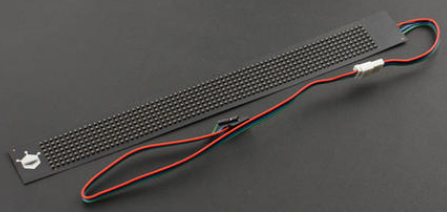

# DFRobot_Flexible_STC8F

* [中文](./README_CN.md)

这是STC8F系列柔性RGB点阵屏，它具有以下特点：
1. 串口通讯设置: 19200波特率，8数据位，1停止位，无校验；
2. 显示字符串；
3. 设置显示字符的前景色和背景色，可设置的颜色如下所示：

   颜色 | 代表字母
   --- | :----------
   红色 |    R 
   黄色 |    Y
   绿色 |    G
   青色 |    C
   蓝色 |    B
   紫色 |    P
   白色 |    W
   黑色 |    B

   例：<br>
   发送字符串 <CRY>DFRobot   屏显示的就是黄底红字的:DFRobot <br>
   发送字符串 <CYR>DFRobot   屏显示的就是红底黄字的:DFRobot <br>

4. 支持红色、黄色、绿色、青色、蓝色、紫色、白色、黑色等8种颜色全屏点亮；
5. 8级别显示亮度设置，级别越高亮度越亮；
6. 8级别移动速度设置，级别越高速度越快；
7. 6种动态显示设置：左移、右移、静止、上移、下移、闪烁，注意：如果设置的显示字符串无法一次性全屏显示(字符串总体宽度大于屏分辨率宽度)，则动态效果只能为左移或右移，设置为其它动态显示效果无效；
8. 预先存储A~K等11个信息列表，设置显示一个或多个信息列表；




## Product Link（[https://www.dfrobot.com/product-1992.html](https://www.dfrobot.com/product-1992.html)）
    SKU: DFR0597

## Supported Flexible RGB Matrixs
* 7x71  Flexible RGB LED Matrix
* 12x48 Flexible RGB LED Matrix

## Table of Contents

* [Summary](#summary)
* [Installation](#installation)
* [Methods](#methods)
* [Compatibility](#compatibility)
* [Credits](#credits)

## Summary
这是DFRobot为STC8F系列柔性RGB点阵屏提供的一个Arduino驱动库，它具有以下特点：
1. 显示不同前景色和背景色的字符串，例：显示白底红字DFRobot：
   ```C++
   displayMessage("<CRW>DFRobot");
   ```
   或
   ```C++
   displayMessage("DFRobot",eColorRed, eColorWhite);
   ```
2. 设置显示亮度：亮度等级1 ~ 亮度等级8，等级越高，亮度越亮；
3. 设置动态显示的移动速度：速度等级1 ~ 速度等级8，等级越高，移动速度越快；
4. 预先存储A~K等11个信息列表，设置显示一个或多个信息列表；
5. 全屏点亮、支持红色、黄色、绿色、青色、蓝色、紫色、白色、黑色等颜色全屏显示
6. 设置动态显示效果：左移、右移、静止、上移、下移、闪烁
* 注意： 静止、上移、下移、闪烁等显示效果，只在显示字符不超过屏最大分辨率时有效，超过则无效，将显示为左移或右移效果，设置后需调用displayMessage 或 setMessageList才能生效<br>

# Installation

To use this library, first download the library file, paste it into the \Arduino\libraries directory, then open the examples folder and run the demo in the folder.

## Methods

```C++
  /**
   * @fn DFRobot_SerialScreen771
   * @brief DFRobot_SerialScreen771 constructor
   * @param s_ Abstract class Stream, users need to transmit its serial subclass object.
   */
  DFRobot_SerialScreen771(Stream &s_);

  /**
   * @fn DFRobot_SerialScreen1248
   * @brief DFRobot_SerialScreen1248 constructor
   * @param s_ Abstract class Stream, users need to transmit its serial subclass object.
   */
  DFRobot_SerialScreen1248(Stream &s_);
  /**
   * @fn DFRobot_Flexible_STC8F
   * @brief DFRobot_Flexible_STC8F constructor
   * @param s_ Abstract class Stream, users need to transmit its serial subclass object.
   * @param width 柔性串口屏分辨率的宽度
   * @n      71   7x71  Flexible RGB LED Matrix
   * @n      48   12x48 Flexible RGB LED Matrix
   */
  DFRobot_Flexible_STC8F(Stream &s_, uint16_t width);
  /**
   * @fn begin
   * @brief Initialize the screen
   * @return  Init status
   * @retval true  Init succeeded
   * @retval false Init failed
   */
  bool begin();
  /**
   * @fn setMoveMode
   * @brief Set banner information move mode，此模式设置后，需调用displayMessage或setMessageList才能生效。.
   * @param m_  Move direction
   * @n     eMoveLeft        banner move left
   * @n     eMoveRight       banner move right
   * @n     eMoveHold        banner hold still
   * @n     eMoveUp          banner move up
   * @n     eMoveDown        banner move down
   * @n     eMoveFlash       banner flash
   * @return  Setting status
   * @retval true  Setting succeeded
   * @retval false Setting failed
   */
  void setMoveMode(eMoveMode_t m_);

  /**
   * @fn displayMessage
   * @brief 显示字符串信息，可在字符串上插入<C_ _>改变后续信息的颜色，字符串的字体颜色和背景色可以被设置为以下颜色
   * @n ------------------------------
   * @n 颜色    | 代表字母
   * @n 红色    |    R 
   * @n 黄色    |    Y
   * @n 绿色    |    G
   * @n 青色    |    C
   * @n 蓝色    |    B
   * @n 紫色    |    P
   * @n 白色    |    W
   * @n 黑色    |    B
   * @n 例：displayMessage("<CRW>DFRobot")表示屏显示的是白底红字的DFRobot，等价于displayMessage("DFRobot", eColorRed, eColorWhite)
   * @n 例：displayMessage("<CWY>DFRobot")表示屏显示的是红底白字的DFRobot, 等价于displayMessage("DFRobot", eColorWhite, eColorRed)
   * @n 例：displayMessage("DFRobot")表示屏显示的是不指定颜色的DFRobot
   * @param message_  display information   
   */
  void displayMessage(const char *message_);
  /**
   * @fn displayMessage
   * @brief 设置显示信息的字体的颜色和背景颜色.
   * @param message_  display information
   * @param font  font display color
   * @n     eColorRed      red
   * @n     eColorYellow   yellow
   * @n     eColorGreen    green
   * @n     eColorCyan     cyan
   * @n     eColorBlue     blue
   * @n     eColorPurple   purple
   * @n     eColorWhite    white
   * @n     eColorBlack    black
   * @param shading  font shading
   * @n     eColorRed      red
   * @n     eColorYellow   yellow
   * @n     eColorGreen    green
   * @n     eColorCyan     cyan
   * @n     eColorBlue     blue
   * @n     eColorPurple   purple
   * @n     eColorWhite    white
   * @n     eColorBlack    black
   * @return  Setting status
   * @retval true  Setting succeeded
   * @retval false Setting failed
   */
  void displayMessage(const char *message_, eColorMode_t font , eColorMode_t shading);

  /**
   * @fn setBrightness
   * @brief Set brightness level, higher level for higher brightness.
   * @param b_  Brightness level
   * @n eBrightLevel_1    brightness level 1
   * @n eBrightLevel_2    brightness level 2
   * @n eBrightLevel_3    brightness level 3
   * @n eBrightLevel_4    brightness level 4
   * @n eBrightLevel_5    brightness level 5
   * @n eBrightLevel_6    brightness level 6
   * @n eBrightLevel_7    brightness level 7
   * @n eBrightLevel_8    brightness level 8
   * @note 如果将显示亮度调大，需要外部供电，以防止因供电不足，导致显示颜色效果和预期有差异
   * @return  Setting status
   * @retval true  Setting succeeded
   * @retval false Setting failed
   */
  bool setBrightness(eBrightLevel_t b_);
  /**
   * @fn setMoveSpeed
   * @brief Set banner information move speed.
   * @param s_  Set speed level, higher level for higher speed.
   * @n eSpeedLevel_1    move speed level 1
   * @n eSpeedLevel_2    move speed level 2
   * @n eSpeedLevel_3    move speed level 3
   * @n eSpeedLevel_4    move speed level 4
   * @n eSpeedLevel_5    move speed level 5
   * @n eSpeedLevel_6    move speed level 6
   * @n eSpeedLevel_7    move speed level 7
   * @n eSpeedLevel_8    move speed level 8
   * @return  Setting status
   * @retval true  Setting succeeded
   * @retval false Setting failed
   */
  bool setMoveSpeed(eSpeedLevel_t s_);
  /**
   * @fn setMessageList
   * @brief Set message list, this screen can store 8 message lists, and users can change the content in any list by the function.
   * @param banN  banN  Display the set of message list serial numbers
   * @n eBanner_1 or 1 << 0 Set the content of the 1st message list
   * @n eBanner_2 or 1 << 1 Set the content of the 2nd message list
   * @n eBanner_3 or 1 << 2 Set the content of the 3rd message list
   * @n eBanner_4 or 1 << 3 Set the content of the 4th message list
   * @n eBanner_5 or 1 << 4 Set the content of the 5th message list
   * @n eBanner_6 or 1 << 5 Set the content of the 6th message list
   * @n eBanner_7 or 1 << 6 Set the content of the 7th message list
   * @n eBanner_8 or 1 << 7 Set the content of the 8th message list
   * @n eBanner_ALL or 0xFF Set all the message lists to the same content
   * @n eBanner_1 ~ eBanner_7 can be combined random, which indicates the combined two message lists are set to the same content, for example: eBanner_1 | eBanner_8 indicates the contents of the 1st and the 8th message lists are set to the same.
   * @n message_ Message content
   * @return  Setting status
   * @retval true  Setting succeeded
   * @retval false Setting failed
   */
  bool setMessageList(uint16_t banN, const char *message_);
  bool setMessageList(eBanner_t banN, const char *message_);

  /**
   * @fn setMessageList
   * @brief Set message list, this screen can store 8 message lists, and users can change the content in any list by the function.
   * @param banN  banN  Display the set of message list serial numbers
   * @n eBanner_1 or 1 << 0 Set the content of the 1st message list
   * @n eBanner_2 or 1 << 1 Set the content of the 2nd message list
   * @n eBanner_3 or 1 << 2 Set the content of the 3rd message list
   * @n eBanner_4 or 1 << 3 Set the content of the 4th message list
   * @n eBanner_5 or 1 << 4 Set the content of the 5th message list
   * @n eBanner_6 or 1 << 5 Set the content of the 6th message list
   * @n eBanner_7 or 1 << 6 Set the content of the 7th message list
   * @n eBanner_8 or 1 << 7 Set the content of the 8th message list
   * @n eBanner_ALL or 0xFF Set all the message lists to the same content
   * @n eBanner_1 ~ eBanner_7 can be combined random, which indicates the combined two message lists are set to the same content, for example: eBanner_1 | eBanner_8 indicates the contents of the 1st and the 8th message lists are set to the same.
   * @n message_ Message content
   * @param m_  Move direction
   * @n     eMoveLeft        banner move left
   * @n     eMoveRight       banner move right
   * @n     eMoveHold        banner hold still
   * @n     eMoveUp          banner move up
   * @n     eMoveDown        banner move down
   * @n     eMoveFlash       banner flash
   * @return  Setting status
   * @retval true  Setting succeeded
   * @retval false Setting failed
   */
  bool setMessageList(uint16_t banN, const char *message_, eMoveMode_t m_);
  bool setMessageList(eBanner_t banN, const char *message_, eMoveMode_t m_);
  /**
   * @fn displayBanner
   * @brief Display the banner information in message lists, this screen stores the information of 8 data lists, users can use this function to display one or more information lists in order
   * @param banN  banN  Display the set of message list serial numbers
   * @n eBanner_1 or 1 << 0 The banner message of the 1st message list stored in the display
   * @n eBanner_2 or 1 << 1 The banner message of the 2nd message list stored in the display
   * @n eBanner_3 or 1 << 2 The banner message of the 3rd message list stored in the display
   * @n eBanner_4 or 1 << 3 The banner message of the 4th message list stored in the display
   * @n eBanner_5 or 1 << 4 The banner message of the 5th message list stored in the display
   * @n eBanner_6 or 1 << 5 The banner message of the 6th message list stored in the display
   * @n eBanner_7 or 1 << 6 The banner message of the 7th message list stored in the display
   * @n eBanner_8 or 1 << 7 The banner message of the 8th message list stored in the display
   * @n eBanner_ALL or 0xFF Display all the stored message lists in order
   * @n eBanner_1 ~ eBanner_7 can be combined random, which means to display the selected banner information in order, for example: eBanner_1 | eBanner_8 means to display the 1st and the 8th banner information.
   * @return  None
   */
  void displayBanner(uint16_t banN);
  void displayBanner(eBanner_t banN);
  /**
   * @fn setFullScreenColor
   * @brief Full screen lights up to show a certain color
   * @param color_  RGB color
   * @n     eColorRed      red
   * @n     eColorYellow   yellow
   * @n     eColorGreen    green
   * @n     eColorCyan     cyan
   * @n     eColorBlue     blue
   * @n     eColorPurple   purple
   * @n     eColorWhite    white
   * @n     eColorBlack    black
   * @return  set state
   * @retval true  success
   * @retval false failed
   */
  bool setFullScreenColor(eColorMode_t color_);
```

## Compatibility

MCU                | Work Well | Work Wrong | Untested  | Remarks
------------------ | :----------: | :----------: | :---------: | -----
Arduino uno |       √      |             |            | 
Arduino Leonardo |       √      |             |            | 
Arduino Mega2560  |       √      |             |            | 

## History
- 2022/03/17 - Version 1.0.0 released.

## Credits

Written by Arya(xue.peng@dfrobot.com), 2022. (Welcome to our [website](https://www.dfrobot.com/))
