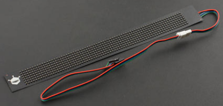

# DFRobot_Flexible_STC8F

* [English Version](./README.md)

这是STC8F系列柔性RGB点阵屏，它具有以下特点：
1. 串口通讯设置: 19200波特率，8数据位，1停止位，无校验；
2. 显示字符串；
3. 设置显示字符的前景色和背景色，可设置的颜色如下所示：

   颜色 | 代表字母
   --- | :----------
   红色 |    R 
   黄色 |    Y
   绿色 |    G
   青色 |    C
   蓝色 |    B
   紫色 |    P
   白色 |    W
   黑色 |    B

   例：<br>
   发送字符串 <CRY>DFRobot   屏显示的就是黄底红字的:DFRobot <br>
   发送字符串 <CYR>DFRobot   屏显示的就是红底黄字的:DFRobot <br>

4. 支持红色、黄色、绿色、青色、蓝色、紫色、白色、黑色等8种颜色全屏点亮；
5. 8级别显示亮度设置，级别越高亮度越亮；
6. 8级别移动速度设置，级别越高速度越快；
7. 6种动态显示设置：左移、右移、静止、上移、下移、闪烁，注意：如果设置的显示字符串无法一次性全屏显示(字符串总体宽度大于屏分辨率宽度)，则动态效果只能为左移或右移，设置为其它动态显示效果无效；
8. 预先存储A~K等11个信息列表，设置显示一个或多个信息列表；





## 产品链接（[https://www.dfrobot.com.cn/goods-2651.html](https://www.dfrobot.com.cn/goods-2651.html)）
    SKU: DFR0597  

## 支持的柔性屏种类
* 7x71  Flexible RGB LED Matrix
* 12x48 Flexible RGB LED Matrix

   
## 目录

* [概述](#概述)
* [库安装](#库安装)
* [方法](#方法)
* [兼容性](#兼容性)
* [历史](#历史)
* [创作者](#创作者)

## 概述

这是DFRobot为STC8F系列柔性RGB点阵屏提供的一个Arduino驱动库，它具有以下特点：
1. 显示不同前景色和背景色的字符串，例：显示白底红字DFRobot：
   ```C++
   displayMessage("<CRW>DFRobot");
   ```
   或
   ```C++
   displayMessage("DFRobot",eColorRed, eColorWhite);
   ```
2. 设置显示亮度：亮度等级1 ~ 亮度等级8，等级越高，亮度越亮；
3. 设置动态显示的移动速度：速度等级1 ~ 速度等级8，等级越高，移动速度越快；
4. 预先存储A~K等11个信息列表，设置显示一个或多个信息列表；
5. 全屏点亮、支持红色、黄色、绿色、青色、蓝色、紫色、白色、黑色等颜色全屏显示
6. 设置动态显示效果：左移、右移、静止、上移、下移、闪烁
* 注意： 静止、上移、下移、闪烁等显示效果，只在显示字符不超过屏最大分辨率时有效，超过则无效，将显示为左移或右移效果，设置后需调用displayMessage或setMessageList才能生效<br>


## 库安装

使用此库前，请首先下载库文件，将其粘贴到\Arduino\libraries目录中，然后打开examples文件夹并在该文件夹中运行演示。

## 方法

```C++
  /**
   * @fn DFRobot_SerialScreen771
   * @brief DFRobot_SerialScreen771 构造函数
   * @param s_ 抽象类Stream，用户需传递它的串口子类对象
   */
  DFRobot_SerialScreen771(Stream &s_);

  /**
   * @fn DFRobot_SerialScreen1248
   * @brief DFRobot_SerialScreen1248 构造函数
   * @param s_ 抽象类Stream，用户需传递它的串口子类对象
   */
  DFRobot_SerialScreen1248(Stream &s_);
  /**
   * @fn DFRobot_Flexible_STC8F
   * @brief DFRobot_Flexible_STC8F 构造函数
   * @param s_ 抽象类Stream，用户需传递它的串口子类对象
   * @param width 柔性串口屏分辨率的宽度
   * @n      71   7x71  Flexible RGB LED Matrix
   * @n      48   12x48 Flexible RGB LED Matrix
   */
  DFRobot_Flexible_STC8F(Stream &s_, uint16_t width);
  /**
   * @fn begin
   * @brief 屏初始化。
   * @return  初始化状态
   * @retval true  初始化成功
   * @retval false 初始化失败
   */
  bool begin();

  /**
   * @fn setMoveMode
   * @brief 设置横幅信息移动模式， 此模式设置后，需调用displayMessage或setMessageList才能生效。
   * @param m_  移动方向
   * @n     eMoveLeft        横幅左移动 
   * @n     eMoveRight       横幅右移动 
   * @n     eMoveHold        横幅不移动，静止不动
   * @n     eMoveUp          横幅上移
   * @n     eMoveDown        横幅下移
   * @n     eMoveFlash       横幅闪烁
   * @return  设置状态
   * @retval true  设置成功
   * @retval false 设置失败
   */
  void setMoveMode(eMoveMode_t m_);

  /**
   * @fn displayMessage
   * @brief 显示字符串信息，可在字符串上插入<C_ _>改变后续信息的颜色，字符串的字体颜色和背景色可以被设置为以下颜色
   * @n ------------------------------
   * @n 颜色    | 代表字母
   * @n 红色    |    R 
   * @n 黄色    |    Y
   * @n 绿色    |    G
   * @n 青色    |    C
   * @n 蓝色    |    B
   * @n 紫色    |    P
   * @n 白色    |    W
   * @n 黑色    |    B
   * @n 例：displayMessage("<CRW>DFRobot")表示屏显示的是白底红字的DFRobot，等价于displayMessage("DFRobot", eColorRed, eColorWhite)
   * @n 例：displayMessage("<CWY>DFRobot")表示屏显示的是红底白字的DFRobot, 等价于displayMessage("DFRobot", eColorWhite, eColorRed)
   * @n 例：displayMessage("DFRobot")表示屏显示的是不指定颜色的DFRobot
   * @param message_  显示字符串   
   */
  void displayMessage(const char *message_);
  /**
   * @fn displayMessage
   * @brief 设置显示信息的字体的颜色和背景颜色.
   * @param message_  display information
   * @param font  font display color
   * @n     eColorRed      红色
   * @n     eColorYellow   黄色
   * @n     eColorGreen    绿色
   * @n     eColorCyan     青色
   * @n     eColorBlue     蓝色
   * @n     eColorPurple   紫色
   * @n     eColorWhite    白色
   * @n     eColorBlack    黑色
   * @param shading  font shading
   * @n     eColorRed      红色
   * @n     eColorYellow   黄色
   * @n     eColorGreen    绿色
   * @n     eColorCyan     青色
   * @n     eColorBlue     蓝色
   * @n     eColorPurple   紫色
   * @n     eColorWhite    白色
   * @n     eColorBlack    黑色
   */
  void displayMessage(const char *message_, eColorMode_t font , eColorMode_t shading);

  /**
   * @fn setBrightness
   * @brief 设置亮度等级，等级越高，亮度越亮。
   * @param b_  亮度等级
   * @n eBrightLevel_1    1级亮度
   * @n eBrightLevel_2    2级亮度
   * @n eBrightLevel_3    3级亮度
   * @n eBrightLevel_4    4级亮度
   * @n eBrightLevel_5    5级亮度
   * @n eBrightLevel_6    6级亮度
   * @n eBrightLevel_7    7级亮度
   * @n eBrightLevel_8    8级亮度
   * @return  设置状态
   * @retval true  设置成功
   * @retval false 设置失败
   */
  bool setBrightness(eBrightLevel_t b_);
  /**
   * @fn setMoveSpeed
   * @brief 设置横幅移动速度。
   * @param s_  移动速度级别，级别越高，移动速度越快
   * @n eSpeedLevel_1    1级移动速度
   * @n eSpeedLevel_2    2级移动速度
   * @n eSpeedLevel_3    3级移动速度
   * @n eSpeedLevel_4    4级移动速度
   * @n eSpeedLevel_5    5级移动速度
   * @n eSpeedLevel_6    6级移动速度
   * @n eSpeedLevel_7    7级移动速度
   * @n eSpeedLevel_8    8级移动速度
   * @return  设置状态
   * @retval true  设置成功
   * @retval false 设置失败
   */
  bool setMoveSpeed(eSpeedLevel_t s_);
  /**
   * @fn setMessageList
   * @brief 设置信息列表，此屏可存储8个信息列表，用户可以通过此函数修改任意列表中的内容。
   * @param banN  banN  显示信息列表序号集合
   * @n eBanner_1 or 1 << 0 设置第1个信息列表中的内容
   * @n eBanner_2 or 1 << 1 设置第2个信息列表中的内容
   * @n eBanner_3 or 1 << 2 设置第3个信息列表中的内容
   * @n eBanner_4 or 1 << 3 设置第4个信息列表中的内容
   * @n eBanner_5 or 1 << 4 设置第5个信息列表中的内容
   * @n eBanner_6 or 1 << 5 设置第6个信息列表中的内容
   * @n eBanner_7 or 1 << 6 设置第7个信息列表中的内容
   * @n eBanner_8 or 1 << 7 设置第8个信息列表中的内容
   * @n eBanner_ALL or 0xFF 将所有信息列表设置为同一内容
   * @n eBanner_1 ~ eBanner_7可以任意组合，表示将这两个信息列表设置为同一内容，例： eBanner_1 | eBanner_8 表示显示第1个和第8个信息列表的内容设置为同一内容。
   * @n message_ 信息内容
   * @return  设置状态
   * @retval true  设置成功
   * @retval false 设置失败
   */
  bool setMessageList(uint8_t banN, const char *message_);
  bool setMessageList(eBanner_t banN, const char *message_);
  
  /**
   * @fn setMessageList
   * @brief 设置信息列表，此屏可存储8个信息列表，用户可以通过此函数修改任意列表中的内容。
   * @param banN  banN  显示信息列表序号集合
   * @n eBanner_1 or 1 << 0 设置第1个信息列表中的内容
   * @n eBanner_2 or 1 << 1 设置第2个信息列表中的内容
   * @n eBanner_3 or 1 << 2 设置第3个信息列表中的内容
   * @n eBanner_4 or 1 << 3 设置第4个信息列表中的内容
   * @n eBanner_5 or 1 << 4 设置第5个信息列表中的内容
   * @n eBanner_6 or 1 << 5 设置第6个信息列表中的内容
   * @n eBanner_7 or 1 << 6 设置第7个信息列表中的内容
   * @n eBanner_8 or 1 << 7 设置第8个信息列表中的内容
   * @n eBanner_ALL or 0xFF 将所有信息列表设置为同一内容
   * @n eBanner_1 ~ eBanner_7可以任意组合，表示将这两个信息列表设置为同一内容，例： eBanner_1 | eBanner_8 表示显示第1个和第8个信息列表的内容设置为同一内容。
   * @param m_  移动方向
   * @n     eMoveLeft        横幅左移动 
   * @n     eMoveRight       横幅右移动 
   * @n     eMoveHold        横幅不移动，静止不动
   * @n     eMoveUp          横幅上移
   * @n     eMoveDown        横幅下移
   * @n     eMoveFlash       横幅闪烁
   * @return  设置状态
   * @retval true  设置成功
   * @retval false 设置失败
   */
  bool setMessageList(uint16_t banN, const char *message_, eMoveMode_t m_);
  bool setMessageList(eBanner_t banN, const char *message_, eMoveMode_t m_);

  /**
   * @fn displayBanner
   * @brief 显示信息列表中的横幅信息，此屏存储了8个数据列表信息，用户可以通过此函数按序显示其中一个或多个信息列表
   * @param banN  banN  显示信息列表序号集合
   * @n eBanner_1 or 1 << 0 显示屏中储存的第1个信息列表横幅信息
   * @n eBanner_2 or 1 << 1 显示屏中储存的第2个信息列表横幅信息
   * @n eBanner_3 or 1 << 2 显示屏中储存的第3个信息列表横幅信息
   * @n eBanner_4 or 1 << 3 显示屏中储存的第4个信息列表横幅信息
   * @n eBanner_5 or 1 << 4 显示屏中储存的第5个信息列表横幅信息
   * @n eBanner_6 or 1 << 5 显示屏中储存的第6个信息列表横幅信息
   * @n eBanner_7 or 1 << 6 显示屏中储存的第7个信息列表横幅信息
   * @n eBanner_8 or 1 << 7 显示屏中储存的第8个信息列表横幅信息
   * @n eBanner_ALL or 0xFF 按序显示所有存储信息列表
   * @n eBanner_1 ~ eBanner_7可以任意组合，表示需按序显示选中的横幅信息，例： eBanner_1 | eBanner_8 表示显示第1个和第8个横幅信息。
   * @return  None
   */
  void displayBanner(uint8_t banN);
  void displayBanner(eBanner_t banN);

  /**
   * @fn setFullScreenColor
   * @brief 设置全屏点亮颜色
   * @param color_  RGB color
   * @n     eColorRed      红色
   * @n     eColorYellow   黄色
   * @n     eColorGreen    绿色
   * @n     eColorCyan     青色
   * @n     eColorBlue     蓝色
   * @n     eColorPurple   紫色
   * @n     eColorWhite    白色
   * @n     eColorBlack    黑色
   * @return  设置状态
   * @retval true  成功
   * @retval false 失败
   */
  bool setFullScreenColor(eColorMode_t color_);
```

## 兼容性

MCU                | Work Well | Work Wrong | Untested  | Remarks
------------------ | :----------: | :----------: | :---------: | -----
Arduino uno |       √      |             |            | 
Arduino Leonardo |       √      |             |            | 
Arduino Mega2560  |       √      |             |            | 

## 历史

- 2022/03/17 - 1.0.0 版本

## 创作者

Written by Arya(xue.peng@dfrobot.com), 2022. (Welcome to our [website](https://www.dfrobot.com/))


